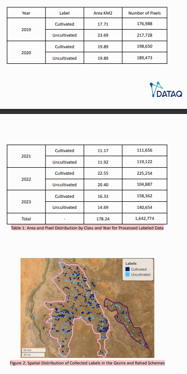
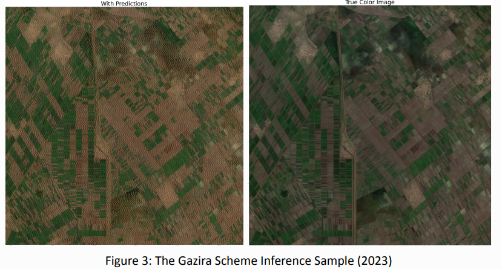
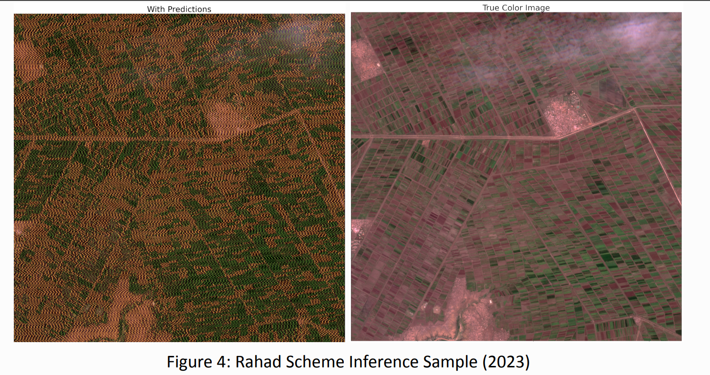
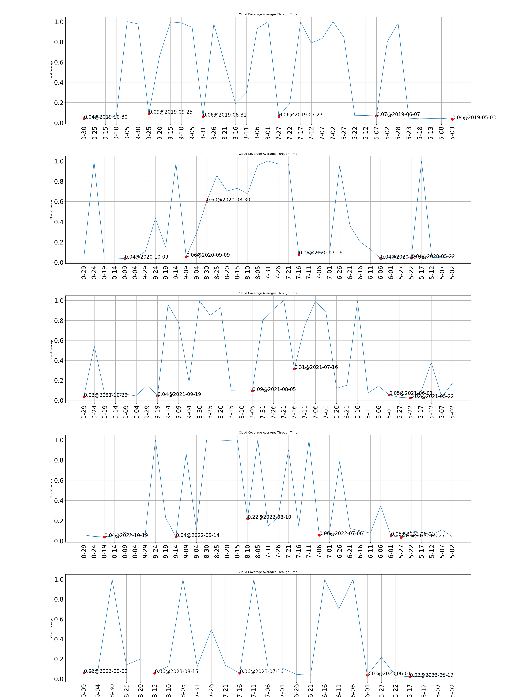
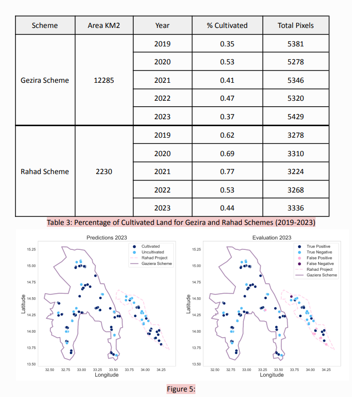

## Code Structure

1. **Data Retrieval**: I fetch Sentinel-2 LA satellite data for the required regions.
2. **Region Masking**: I apply region-specific masks to focus on Sudan.
3. **Training**: I train a stacked classifier for cropland extent mapping.
4. **Inference**: I generate cropland extent maps for the target regions using the trained model.

## Getting Started

To use my code and replicate the results, follow these steps:

1. **Install Dependencies**: Make sure you have all the necessary dependencies installed. You can find the list of dependencies in the `requirements.txt` file.

2. **Data Preparation**: Prepare the required data, including satellite imagery and ground truth data. Or you can use the provided pre-processed data geodataframes saved in the `gdfs/` directory as `{country}_{regoin}_processed_gdf.joblib`.

#### Data Visualization

3. **Training**: Train the machine learning model using the provided training dataset. Or you can use the provided pre-trained model saved in the `models/` directory as `{region}_model.joblib`.

4. **Inference**: Generate cropland extent maps for Sudan, Iran, and Afghanistan using the trained model.

## Sample Inference Maps

You can find sample inference maps in the `samples/` directory. These maps showcase the results of my cropland extent mapping solution for Sudan, Iran, and Afghanistan.
#### Sudan: Cropland Extent Map

## Cloud Coverage Analysis

I have also conducted an analysis of cloud coverage over time for the three areas. The results of this analysis are available in the `samples/` directory, where you can find plots and statistics on cloud coverage.
#### Sudan: Cloud Coverage Statistics
 

## Evaluation

#### Results Visualization

## Contact

If you have any questions or feedback regarding my submission, please feel free to reach out to me:
- [Ammar Khairi](mailto:ammarnasraza@gmail.com)

Thank you for your interest in my project!

